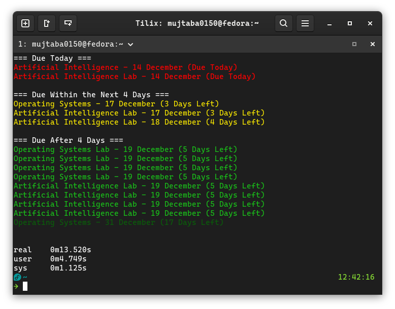
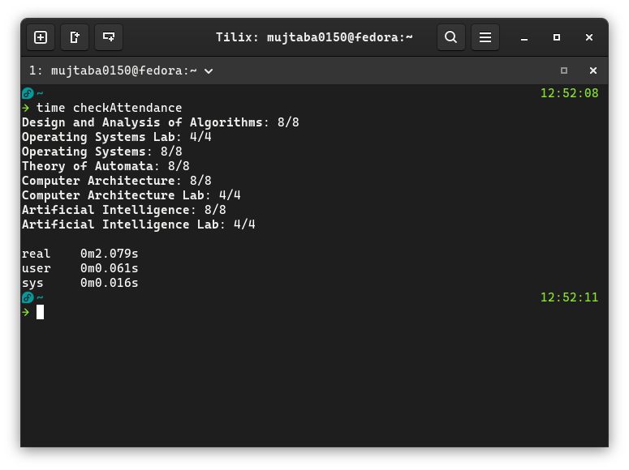

# Bahria University Automation Project

A collection of Python automation scripts to streamline common tasks for Bahria University students, including checking assignments, monitoring attendance, and filling quality assurance surveys.

## Features

### Assignment Tracker (`checkAssignments.py`)
- Fetches all pending and submitted assignments from LMS
- Displays submitted status for assignments
- Automatically downloads assignment files
- Color-coded deadline display based on urgency
- Removes outdated assignment files automatically
- Multiple notification options (KDE Connect, Ntfy)
- Supports WhatsApp-formatted output for group descriptions

### Attendance Monitor (`checkAttendance.py`)
- Displays remaining absences for each course
- Calculates maximum allowed absences based on credit hours
- Handles both regular courses and lab courses differently
- Clean, formatted output with subject-wise breakdown

### Survey Automation (`fillSurveys.py`)
- Automatically fills quality assurance surveys (Teacher Evaluation and Course Evaluation)
- Supports both automatic and manual filling modes
- Persistent browser sessions for seamless authentication
- Option to customize responses for individual surveys

## Requirements

- Python 3.8+
- Playwright
- python-dotenv
- requests

## Installation

### Automated Setup (Recommended)

The repository includes automated setup scripts that handle Python installation, dependency management, environment configuration, and PATH setup.

#### Windows

Run the batch script with administrator privileges (if installing for all users):

```bat
setup.bat
```

The script will:
1. Check for Python installation (install via winget if missing)
2. Upgrade pip and install all required dependencies from `requirements.txt`
3. Prompt you to enter all required environment variables
4. Create a `.env` file automatically
5. Ask whether to install for current user or all users:
   - **Current user only**: Adds script directory to user PATH
   - **All users**: Adds script directory to system PATH (requires administrator privileges)
6. Create command aliases for easy script execution

After setup completes, restart your terminal to apply PATH changes.

#### Linux / macOS

Run the bash script:

```bash
chmod +x setup.sh
./setup.sh
```

The script will:
1. Check for Python installation (install via package manager if missing)
2. Upgrade pip and install all required dependencies from `requirements.txt`
3. Prompt you to enter all required environment variables
4. Create a `.env` file automatically
5. Ask whether to install for current user or all users:
   - **Current user only**: Adds script directory to user PATH (via ~/.bashrc, ~/.zshrc, or ~/.profile)
   - **All users**: Adds script directory to system PATH at /etc/profile.d/ (requires sudo)
6. Create aliases in your shell configuration file (bash/zsh) or as standalone executable scripts

After setup completes, restart your terminal to apply PATH changes.

### Manual Setup

If you prefer manual installation:

1. **Clone or download the repository**

2. **Install Python dependencies**
   ```bash
   pip install -r requirements.txt
   ```

3. **Install Playwright browsers**
   ```bash
   playwright install chromium
   ```

4. **Create a `.env` file** in the project root directory with the following variables:
   ```env
   ENROLLMENT_NUMBER=your_enrollment_number
   PASSWORD=your_password
   USER_DATA_DIR=/path/to/browser/profile
   DOWNLOAD_DIR=/path/to/downloads
   
   # Optional
   
   # Institution selection (default: 6)
   INSTITUTION=6
   
   # Demographic information for surveys (fillSurveys.py)
   DISABLED=0          # 0=Non-disabled, 1=Disabled
   GENDER=0            # 0=Male, 1=Female
   AGE=0               # 0=<22, 1=22-29, 2=>29
   ON_CAMPUS=1         # 0=Off Campus, 1=On Campus
   
   # Notification configuration (checkAssignments.py)
   NOTIFICATION_LEVEL=0  # 0-4 (0=all notifications, 4=only overdue)
   NOTIFY_SUBMITTED=1    # 0=exclude, 1=include submitted assignments
   ```

### Environment Variables Explanation

#### Required Variables (All Scripts)

| Variable | Required For | Description |
|----------|-------------|-------------|
| `ENROLLMENT_NUMBER` | All scripts | Your Bahria University enrollment number |
| `PASSWORD` | All scripts | Your CMS password |
| `USER_DATA_DIR` | All scripts | Path to persistent browser profile (e.g., `/home/username/.config/ms-playwright`, `C:\Users\username\AppData\Local\ms-playwright`) |
| `DOWNLOAD_DIR` | `checkAssignments.py` | Directory where assignment files will be downloaded |
| `INSTITUTION` | All scripts | Institution selection on login page (default: 6) |

#### Optional Variables (for fillSurveys.py and checkAssignments.py)

These variables are optional and provide additional configuration:

| Variable | Default | Options | Used By | Description |
|----------|---------|---------|---------|-------------|
| `DISABLED` | 0 | 0=Non-disabled, 1=Disabled | `fillSurveys.py` | Disability status for demographic questions |
| `GENDER` | 0 | 0=Male, 1=Female | `fillSurveys.py` | Gender for demographic questions |
| `AGE` | 0 | 0=<22, 1=22-29, 2=>29 | `fillSurveys.py` | Age range for demographic questions |
| `ON_CAMPUS` | 1 | 0=Off Campus, 1=On Campus | `fillSurveys.py` | Residence status for demographic questions |
| `NOTIFICATION_LEVEL` | 0 | 0-4 | `checkAssignments.py` | Notification verbosity level (0 = Due Today, 1 = Up to next 4 days, 2 = Up to 7 days, 3 = Up to 14 days, 4 = All notifications) |
| `NOTIFY_SUBMITTED` | 1 | 0/1 | `checkAssignments.py` | Whether to include submitted assignments in notifications |

## Usage

### Check Assignments

View pending assignments and their deadlines:

```bash
python checkAssignments.py
```

**Command-line Options:**

| Option | Description |
|--------|-------------|
| `-d`, `--debug` | Enable debug mode (shows browser window and detailed logs) |
| `-k DEVICE_ID`, `--kde DEVICE_ID` | Send notifications via KDE Connect to specified device |
| `-N SERVER`, `--ntfy SERVER` | Send notifications via Ntfy.sh server |
| `-w`, `--whatsapp` | Format the assignment deadlines for the WhatsApp group description |
| `-n` | Do not download assignments (useful when internet is slow or on mobile data) |

**Note:** The WhatsApp flag formats assignment deadlines using predefined subject abbreviations (see `subjectAbbreviations` dict in the script). Feel free to contribute and add more abbreviations for your subjects as required.

**Examples:**
```bash
# Debug mode
python checkAssignments.py --debug

# Send KDE Connect notifications
python checkAssignments.py --kde your_device_id

# Format for WhatsApp group description
python checkAssignments.py --whatsapp

# Combine options
python checkAssignments.py --debug --kde your_device_id
```

**Color-Coded Output:**
- 🔴 **Red**: Due today (triggers notifications with `-k` or `-N`)
- 🟡 **Yellow(Bright)**: Due within 1 day
- 🟡 **Yellow(Medium)**: Due within 2 days
- 🟡 **Yellow(Dark)**: Due within 3-4 days
- 🟢 **Green (Bright)**: Due within 5-7 days
- 🟢 **Green (Medium)**: Due within 8-14 days
- 🟢 **Green (Dark)**: Due after 14 days
- Submitted assignments are marked with "(Submitted)" suffix

**Screenshot**



`13.5s`, that is less time to check and download all the assignments than it usually takes just to log into the LMS.

---

### Check Attendance

View your attendance status and remaining absences:

```bash
python checkAttendance.py
```

**Debug Mode:**
```bash
python checkAttendance.py --debug
# or
python checkAttendance.py -d
```

**Output Format:**
- Shows remaining absences out of maximum allowed
- Different calculations for lab courses (3 contact hours) vs regular courses
- Formula: Maximum absences = Credit hours × 4 (regular) or Credit hours × 12 (lab)

**Screenshot**



---


### Fill Surveys

Automatically fill quality assurance surveys on CMS:

```bash
python fillSurveys.py
```

**Debug Mode:**
```bash
python fillSurveys.py --debug

# or

python fillSurveys.py -d
```

## Features Breakdown

### Assignment Tracker Features
- **Smart Download Management**: Downloads new assignments and removes outdated ones
- **Duplicate Prevention**: Checks for existing files before downloading
- **Multi-notification Support**: Integrates with KDE Connect and Ntfy.sh
- **Automatic File Organization**: Creates subject-specific folders for downloads

### Attendance Monitor Features
- **Credit-based Calculations**: Accurate absence calculations based on course credits
- **Lab Course Handling**: Special calculation for lab courses with 3 contact hours
- **Clean Formatting**: Removes trailing zeros from decimal values
- **Color-coded Display**: Visual emphasis on course names

### Survey Automation Features
- **Automatic Survey Detection**: Distinguishes between Teacher Evaluation and Course Evaluation forms
- **Persistent Cookies**: Maintains login sessions for a year
- **Selective Form Filling**: Choose which surveys to fill manually or automatically
- **Selective Options Filling**: Choose whether to fill surveys automatically with a single option or whether to fill each option separately
- **Demographic Auto-fill**: Automatically fills demographic information for course surveys using environment variables (configurable via `.env` file)

## Configuration Notes

### Browser Profile Setup
The scripts use a persistent browser profile to maintain login sessions. This means:
- You only need to log in once
- Sessions persist across script runs
- Faster execution after initial setup

### Headless Mode
By default, scripts run in headless mode (no visible browser window). Use `--debug` flag to see the browser in action.

### Assignment Downloads
The `checkAssignments.py` script:
- Creates folders for each subject automatically
- Names files as: `Assignment Name - Deadline Date.extension`
- Removes old assignment files that are no longer active
- Preserves files for currently active assignments

## Notes

- The scripts are designed for Bahria University's CMS and LMS systems
- Survey structure may change over time; the scripts may need updates
- Assignment deadlines are downloaded and organized automatically
- Attendance calculations follow standard university policies (25% absence limit) which may change in the future
- The automated setup scripts (`setup.bat` for Windows, `setup.sh` for Linux/macOS) create command aliases automatically for easier script execution
- A task scheduler script in Windows, and a systemd .service file can also be created to automate deadline notifications

## Contributing

Feel free to fork this project and submit pull requests for improvements or bug fixes.

## Disclaimer

These scripts are provided as-is for educational and convenience purposes. Use responsibly and in accordance with Bahria University's policies. The authors are not responsible for any misuse or violations of university regulations.

## License

This project is open-source and available for personal use.
