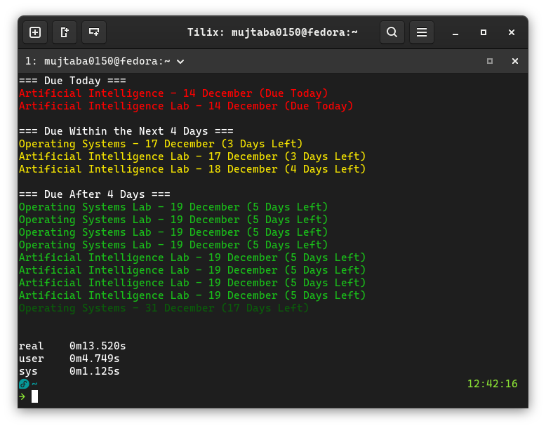
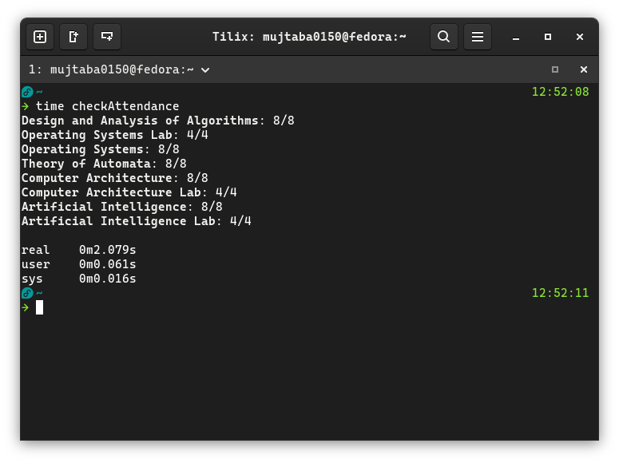

# Bahria University Automation Project

A collection of Python automation scripts to streamline common tasks for Bahria University students, including checking assignments, monitoring attendance, and filling quality assurance surveys.

## How is it Different From Other Similar Projects?


## Features

### Assignment Tracker (`checkAssignments.py`)
- Fetches pending and submitted assignments from LMS
- Automatically downloads and organizes assignment files by date
- Color-coded deadline display based on urgency (red, yellow, green)
- Detects extended deadlines with optional notifications
- Automatic cleanup of outdated assignment files
- Supports notifications via KDE Connect or ntfy.sh with priority levels
- WhatsApp-formatted output for group descriptions
- Comprehensive error logging with HTML snapshots and screenshots

### Attendance Monitor (`checkAttendance.py`)
- Displays remaining absences per course with credit-based calculations
- Handles regular and lab courses differently
- Clean, color-coded output
- Automatic Ntfy.sh notifications when attendance exceeds allowed limits (if GitHub Actions is set up)
- Comprehensive error logging and debugging

### Survey Automation (`fillSurveys.py`)
- Automatically fills quality assurance surveys (Teacher and Course Evaluation)
- Supports automatic or manual filling modes with selective options
- Persistent browser sessions for faster execution
- Auto-fills demographic information from environment variables

### GitHub Actions Automation (`githubActions.py`)
- Specialized script for scheduled GitHub Actions workflows
- Validates required environment variables at startup
- Sends priority-based notifications via Ntfy.sh with optional file attachments

## Requirements

- Python 3.8+
- Playwright
- python-dotenv
- requests

## Installation

### Automated Setup (Recommended)

The repository includes setup scripts that handle Python installation, dependencies, environment configuration, and PATH setup.

#### Windows

Run the batch script with administrator privileges (if installing for all users):

```bat
setup.bat
```
Run with administrator privileges for system-wide PATH setup.

**Linux / macOS:**
```bash
chmod +x setup.sh
./setup.sh
```
Optionally use `sudo` for system-wide PATH setup.

Both scripts will:
1. Check for Python (install if missing)
2. Upgrade pip and install dependencies from `requirements.txt`
3. Prompt for environment variables and create `.env`
4. Add script directory to PATH (user or system)
5. Create command aliases for scripts
6. Restart your terminal after completion to apply changes

### Manual Setup

1. Clone or download the repository

2. Install Python dependencies:
   ```bash
   pip install -r requirements.txt
   playwright install chromium
   ```

3. Create a `.env` file in the project root with required variables (see below)
   ```env
   ENROLLMENT_NUMBER=your_enrollment_number
   PASSWORD=your_password
   USER_DATA_DIR=/path/to/browser/profile
   DOWNLOAD_DIR=/path/to/downloads
   
   # Optional
   INSTITUTION=6                    # Institution selection (default: 6)
   DISABLED=0                        # 0=Non-disabled, 1=Disabled
   GENDER=0                          # 0=Male, 1=Female
   AGE=0                             # 0=<22, 1=22-29, 2=>29
   ON_CAMPUS=1                       # 0=Off Campus, 1=On Campus
   NOTIFICATION_LEVEL=0              # 0-4 (0=all, 4=only overdue)
   NOTIFY_EXTENDED=1                # 0=exclude, 1=include submitted assignments
   CHECK_UPDATES=1                   # 0=Don't check, 1=Check for updates
   ```

### Environment Variables Explanation

#### Required Variables

| Variable | Required For | Description |
|----------|-------------|-------------|
| `ENROLLMENT_NUMBER` | All scripts | Your Bahria University enrollment number |
| `PASSWORD` | All scripts | Your CMS password |
| `USER_DATA_DIR` | All scripts | Path to persistent browser profile (e.g., `/home/username/.config/ms-playwright`, `C:\Users\username\AppData\Local\ms-playwright`) |
| `DOWNLOAD_DIR` | `checkAssignments.py` | Directory where assignment files will be downloaded |

#### Optional Variables

These variables are optional and provide additional configuration:

| Variable | Default | Options | Used By | Description |
|----------|---------|---------|---------|-------------|
| `DISABLED` | 0 | 0=Non-disabled, 1=Disabled | `fillSurveys.py` | Disability status for demographic questions |
| `GENDER` | 0 | 0=Male, 1=Female | `fillSurveys.py` | Gender for demographic questions |
| `AGE` | 0 | 0=<22, 1=22-29, 2=>29 | `fillSurveys.py` | Age range for demographic questions |
| `ON_CAMPUS` | 1 | 0=Off Campus, 1=On Campus | `fillSurveys.py` | Residence status for demographic questions |
| `NOTIFICATION_LEVEL` | 0 | 0-4 | `checkAssignments.py`, `githubActions.py` | Notification verbosity level (0 = All assignments, 1 = Due to next 4 days, 2 = Due within 7 days, 3 = Due within 14 days, 4 = After 14 days) |
| `NOTIFY_SUBMITTED` | 1 | 0/1 | `checkAssignments.py`, `githubActions.py` | Whether to include submitted assignments in notifications |
| `NTFY_SERVER` | (empty) | Server name | `githubActions.py`, `Attendance.py` | **Required** for `githubActions.py`. Ntfy.sh server name for push notifications (e.g., "myserver"). Enables Ntfy.sh integration for automated notifications |
| `DOWNLOAD_ASSIGNMENTS` | 1 | 0/1 | `githubActions.py` | Whether to automatically download assignment files and include with ntfy.sh notifications (May use more GitHub Actions minutes) |
| `CHECK_UPDATES` | 1 | 0/1 | All scripts | Whether to check for new versions from GitHub repository |
| `INSTITUTION` | 6 (Islamabad E-8 Campus) | 1-16 | All scripts | Institution selection on login page |

## Usage

### Check Assignments

View pending assignments and their deadlines:

```bash
python checkAssignments.py
```

**Command-line Options:**

| Option | Description |
|--------|-------------|
| `-d`, `--debug` | Enable debug mode (shows browser window and detailed logs) |
| `-k DEVICE_ID`, `--kde DEVICE_ID` | Send notifications via KDE Connect |
| `-N SERVER`, `--ntfy SERVER` | Send notifications via Ntfy.sh server |
| `-w`, `--whatsapp` | Format deadlines for WhatsApp group description |
| `-n` | Skip downloading assignments |

**Color-Coded Output:**
- 🔴 Red: Due today
- 🟡 Yellow: Due within 1-4 days (varying shades)
- 🟢 Green: Due within 5+ days (varying shades)
- Submitted assignments marked with "(Submitted)"
- Extended  assignments marked with "(Extended)"

**Note:** The WhatsApp flag formats assignment deadlines using predefined subject abbreviations (see `subjectAbbreviations` dict in the script). Feel free to contribute and add more abbreviations for your subjects as required.

**Examples:**
```bash
python checkAssignments.py --debug
python checkAssignments.py --kde your_device_id
python checkAssignments.py --whatsapp
```

**Screenshot:** 

`13.5s` to check and download all assignments—faster than logging into the LMS manually.

---

### Check Attendance

View your attendance status and remaining absences:

```bash
python checkAttendance.py --debug
```

**Output:** Shows remaining absences per course with credit-based calculations. Maximum absences = Credit hours × 4 (regular) or Credit hours × 12 (lab).

**Screenshot:** 

---

### Fill Surveys

Automatically fill quality assurance surveys (Teacher and Course Evaluation):

```bash
python fillSurveys.py
```

**Debug Mode:**
```bash
python fillSurveys.py --debug
```

---

### GitHub Actions Automation

The `githubActions.py` script runs automatically on a schedule via GitHub Actions:

**Setup Steps:**

1. Add this workflow file to `.github/workflows/assignment-check.yml`:
   ```yaml
    name: Check Assignments and Attendance
    on:
      schedule:
        - cron: '0 3,9,13 * * *' # Modify to your preference
      workflow_dispatch: # Manual trigger for testing
    
    jobs:
      run-bot:
        runs-on: ubuntu-latest
        timeout-minutes: 3
        
        steps:
          - uses: actions/checkout@v4
          
          - name: Set up Python
            uses: actions/setup-python@v5
            with:
              python-version: '3.11'
          
          - name: Install Dependencies
            run: |
              pip install playwright requests python-dotenv
              playwright install --with-deps chromium
          
          - name: Run Script
            env:
              ENROLLMENT_NUMBER: ${{ secrets.ENROLLMENT_NUMBER }}
              PASSWORD: ${{ secrets.PASSWORD }}
              NTFY_SERVER: ${{ secrets.NTFY_SERVER }}
              NOTIFICATION_LEVEL: ${{ secrets.NOTIFICATION_LEVEL || '0' }}
              NOTIFY_SUBMITTED: ${{ secrets.NOTIFY_SUBMITTED || '1' }}
              NOTIFY_EXTENDED: ${{ secrets.NOTIFY_EXTENDED || '1' }}
              INSTITUTION: ${{ secrets.INSTITUTION || '6' }}
              DOWNLOAD_ASSIGNMENTS: ${{ secrets.DOWNLOAD_ASSIGNMENTS || '0' }}
            
            run: |
              set +e
              python githubActions.py 
              python checkAttendance.py
   ```

2. Add your credentials as GitHub Secrets:
   - `ENROLLMENT_NUMBER`: Your enrollment number
   - `PASSWORD`: Your CMS password
   - `NTFY_SERVER`: Your Ntfy.sh server name (required)
   - `NOTIFICATION_LEVEL`: (Optional) Notification level (0-4)
   - `NOTIFY_SUBMITTED`: (Optional) Include submitted assignments in notifications (0 or 1)
   - `NOTIFY_EXTENDED`: (Optional) Include extended deadline notifications when the assignment has already been submitted (0 or 1)
   - `DOWNLOAD_ASSIGNMENTS`: (Optional) Download assignment files with notifications (0 or 1)

**Notes:**
- `NTFY_SERVER` is required for notifications
- Priority levels: 5=due today, 4=due within 4 days, 3=due within 7-14 days
- Files are attached to notifications when `DOWNLOAD_ASSIGNMENTS=1`

## Configuration Notes

The scripts use a persistent browser profile to maintain login sessions (only log in once). They run in headless mode by default—use `--debug` to see the browser. The `checkAssignments.py` script creates subject-specific folders, names files as `Assignment Name - Deadline Date.extension`, and automatically removes outdated assignment files. The `githubActions.py` script validates all required environment variables at startup and sends error notifications via Ntfy.sh if validation fails.

## Notes

- The scripts are designed for Bahria University's CMS and LMS systems
- Survey structure may change over time; the scripts may need updates
- Assignment deadlines are downloaded and organized automatically
- Attendance calculations follow standard university policies (25% absence limit) which may change in the future
- The automated setup scripts (`setup.bat` for Windows, `setup.sh` for Linux/macOS) create command aliases automatically for easier script execution
- A task scheduler script in Windows, and a systemd .service file can also be created to automate deadline notifications
- **Error Logging**: When errors occur, the scripts automatically save debug HTML and screenshots in the `error_logs/` directory for troubleshooting

## Contributing

Feel free to fork this project and submit pull requests for improvements or bug fixes.

## Disclaimer

These scripts are provided as-is for educational and convenience purposes. Use responsibly and in accordance with Bahria University's policies. The authors are not responsible for any misuse or violations of university regulations.

## License

This project is open-source and available for personal use.
